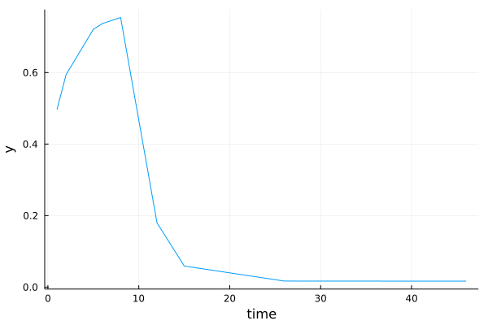

# FastPKSim.jl

[](https://github.com/wahlquisty/FastPKSim.jl/actions/workflows/CI.yml?query=branch%3Amain)
[](https://codecov.io/gh/wahlquisty/FastPKSim.jl)


This package implements a fast simulator of the one, two and three compartment pharmacokinetic (PK) model.
The three compartment model is described by the following differential equations

$$ \dfrac{dx_1}{dt} = - (k_{10} + k_{12} + k_{13}) x_1 + k_{21} x_2 + k_{31} x_3 + \dfrac{1}{V_1} u $$

$$ \dfrac{dx_2}{dt} = k_{12} x_1 - k_{21} x_2 $$

$$ \dfrac{dx_3}{dt} = k_{13} x_1 - k_{31} x_3, $$

where
- $x_i(t)$ is the ith state
- $k_{ij}$ is the transfer rate from compartment $j$ to $i$.
- $u(t)$ is the input
- $V_1$ is the central compartment volume.

You can call the simulator using `pksim!` and the function modifies the input vector `y`.
For speedup, use `Float32` values for your inputs.


```
    pksim!(y, θ, u, v, hs, youts)
Fast simulation of the three compartment mammillary PK model.

The parameter vector θ has the following structure
`θ = [k10, k12, k13, k21, k31, V1]`
# Arguments:
- `y`: Preallocated output vector of size length(youts)
- `θ`: Parameter vector, see above.
- `u`: Infusion rate vector of size length(hs)
- `v`: Bolus dose vector of size length(hs)
- `hs`: Step size, should have the size of [diff(time) diff(time)[end]] where time is the matching time vector to u, v
- `youts`: Indices for output observations, corresponding to times in hs
- `order`: Model order. If argument is left out, order = 3

Updates `y` with simulated output `x_1` at time instances `youts`.
```

## Installation

To install, in the Julia REPL:

```julia
using Pkg; Pkg.add(url="https://github.com/wahlquisty/FastPKSim.jl")
```

## Example:
The following example simulates the three compartment PK model using FastPKSim.jl.
We will simulate a patient model with parameter values $\theta$ with constant infusions and boluses as inputs.

```julia
using FastPKSim, Plots

θ = [1.f0,2.f0,3.f0,4.f0,5.f0,6.f0] # Parameter values, k10, k12, k13, k21, k31, V1

nu = 50 # length of input
u = [1.1f0*ones(Float32,10) ; 0.1f0*ones(Float32,nu-10)] # Infusion rates
v = [2.0f0*ones(Float32,10) ;0.0f0*ones(Float32,nu-10)  ] # Bolus doses

time = 0.f0:1.f0:nu
hs = diff(time)

youts = [2, 3, 6, 7, 9, 13, 16, 27, 46, 47] # observation times, matching time vector

y = zeros(length(youts)) # Create output vector
pksim!(y, θ, u, v, hs, youts) # Simulate model

plot(time[youts], y, xlabel="time", ylabel="y", label="")
```


